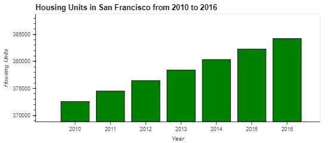

# *San Francisco Housing*
---
We will research and analyze the San Francisco housing prices and rental prices for a proptech company looking to offer an instant, one-click service for people to buy properties and then rent them.  We will collect the data and put the data into visualizations, including aggregation, interactive visualizations, and geospatial analysis to find properties in the San Francisco market that are viable investment opportunities.  

Using the Plotly and the Mapbox API, we will create interactive visualizations with census data stored in the CSV file that is located in the Resources folder.  This CSV contains housing prices, rental prices, of all neighborhoods in San Francisco during 2010 - 2016.

We will visualize the housing units per year, the average prices per square foot, the average prices by neighborhood, and build an interactive neighborhood map.  These visualizations will show if the technology is a worthy investment and help to locate good neighborhoods to invest into.

---
## Technologies:

The Jupyter file utilizes python 3.7 along with the following libraries and dependencies:

os

pandas

plotly

hvplot

pathlib

dotenv

MAPBOX_API_ACCESS_TOKEN


```python
    import os
    import pandas as pd
    import plotly.express as px
    import hvplot.pandas
    from pathlib import Path
    from dotenv import load_dotenv
```

Please create your own .env file with your unique mapbox API access token in order for the mapbox API calls to work.

---

First, we will investigate the overall trend in housing units over the period that we're analyzing (2010 - 2016):


The overall trend is that housing units were steadily increasing year over year in San Francisco from 2010 to 2016. Approximately a 2000 unit increase each year occurred every year during the period being analyzed.

Next, we will plot the average sale prices per square foot:
https://github.com/kevin-mau/san_francisco_housing/blob/main/Images/sales%20price%20gross%20rent.png

The plot shows that sale price dipped slightly in 2011 but has steady increase afterwards.  The gross rent continues to climb higher at a faster rate that sales prices.

Next, we compare the average sale prices by neighborhood:
https://github.com/kevin-mau/san_francisco_housing/blob/main/Images/by%20neighborhood.png

In this interactive visualization, you can toggle the neighborhood to view the data.  

Lastly, we have a scatter visualization where the color codes represent the gross rent.  We can utilize this function to locate the neighborhood with the highest rents.  The size of the dot represents the sale price per square foot.  This helps us locate the neighborhood with the highest sale price per square foot.
https://github.com/kevin-mau/san_francisco_housing/blob/main/Images/sale%20price%20gross%20rent%20scatter.png

Through our interactive visualizations, we have learned that investing in rental properties in San Francisco is worthwhile and the plots also help us to locate some neighborhoods with the best opportunities.

---

## Contributors

kevin-mau

---

## License

MIT
